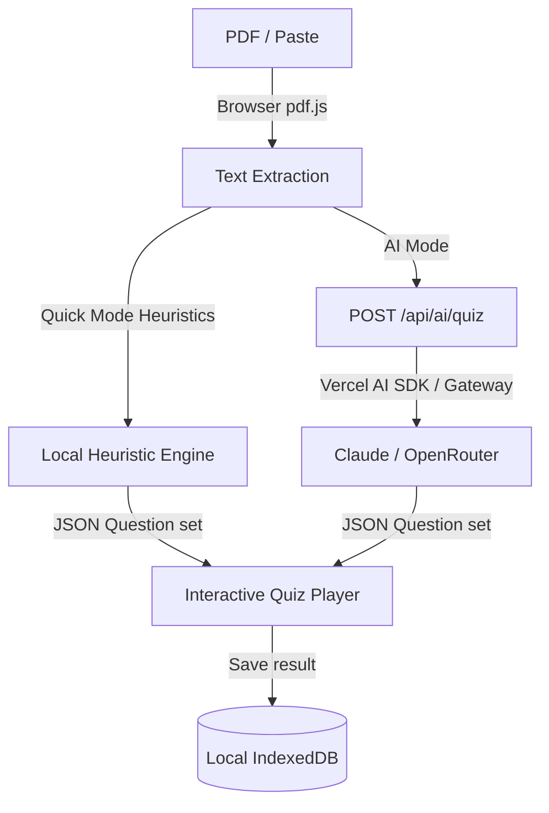

# ARCHITECTURE.md — MK QuizFlow v2

This document describes the software architecture of MK QuizFlow.

## Technology Stack
- **Framework**: Next.js App Router (strict TypeScript), static page pre-rendering (SSG).
- **Styles**: Tailwind CSS v4 with CSS variables.
- **Client Persistence**: IndexedDB via the `idb` package (wrapping standard IndexedDB APIs).
- **AI Integrations**: Vercel AI SDK (with Vercel AI Gateway model routing) and Bring Your Own Key (BYOK) support.

## Project Structure
- `src/app`: Page components and API routes.
- `src/components`: UI widgets and components (layout, player, settings).
- `src/lib`: Common utility libraries (local generator, pdf parser, srs flashcards, storage engine).

## Data Flow Diagram

## Testing strategy
- **Unit (Vitest + v8 coverage):** all pure logic in `src/lib` is unit-tested with AAA-structured, behaviour-named tests — generators, text parsing, scoring, dedupe, the SRS scheduler, derived stats, share/export, AI catalog/models/quota/rate-limit, and the consent-gated analytics no-op. IndexedDB storage is tested with `fake-indexeddb`; DOM-dependent modules use the jsdom environment.
- **Browser/network modules** (`pdf.ts`, `audio.ts`, `ai/client.ts`) are excluded from unit coverage and exercised by the Playwright smoke instead.
- **E2E (Playwright):** the deterministic Quick-mode flow (paste → generate → play → score) runs on desktop and a mobile viewport plus a keyboard-only pass, against the production build on port 3101.
- **CI:** `.github/workflows/ci.yml` runs typecheck, lint, unit tests + coverage, build, gitleaks, a dependency-audit report, and the Playwright smoke.
