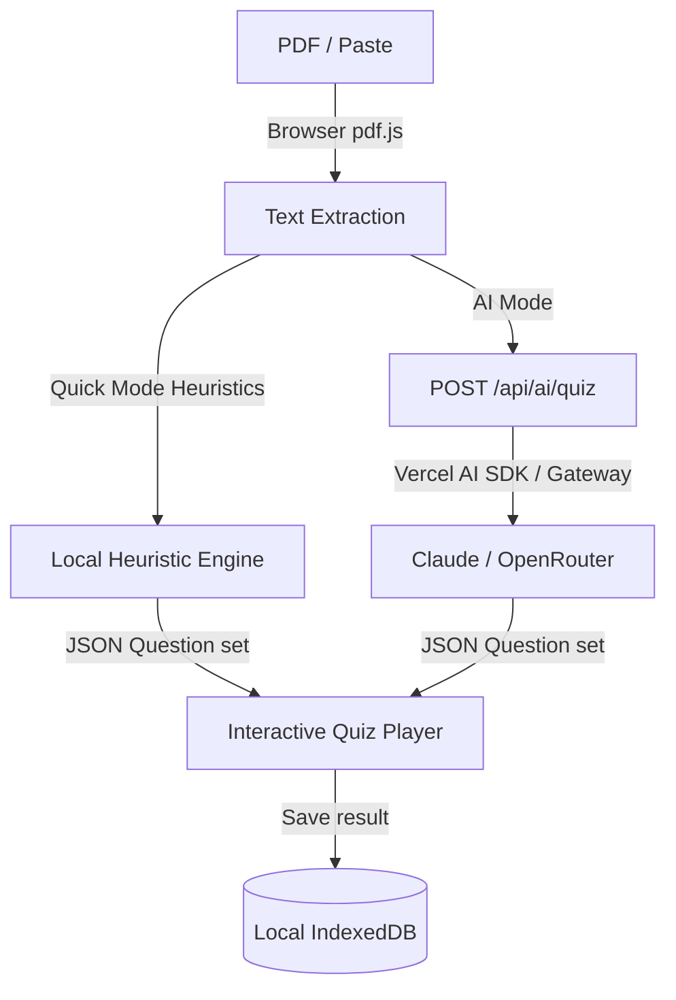

# ARCHITECTURE.md — MK QuizFlow v2

This document describes the software architecture of MK QuizFlow.

## Technology Stack
- **Framework**: Next.js App Router (strict TypeScript), static page pre-rendering (SSG).
- **Styles**: Tailwind CSS v4 with CSS variables.
- **Client Persistence**: IndexedDB via the `idb` package (wrapping standard IndexedDB APIs).
- **AI Integrations**: Vercel AI SDK (with Vercel AI Gateway model routing) and Bring Your Own Key (BYOK) support.

## Project Structure
- `src/app`: Page components and API routes.
- `src/components`: UI widgets and components (layout, player, settings).
- `src/lib`: Common utility libraries (local generator, pdf parser, srs flashcards, storage engine).

## Data Flow Diagram

