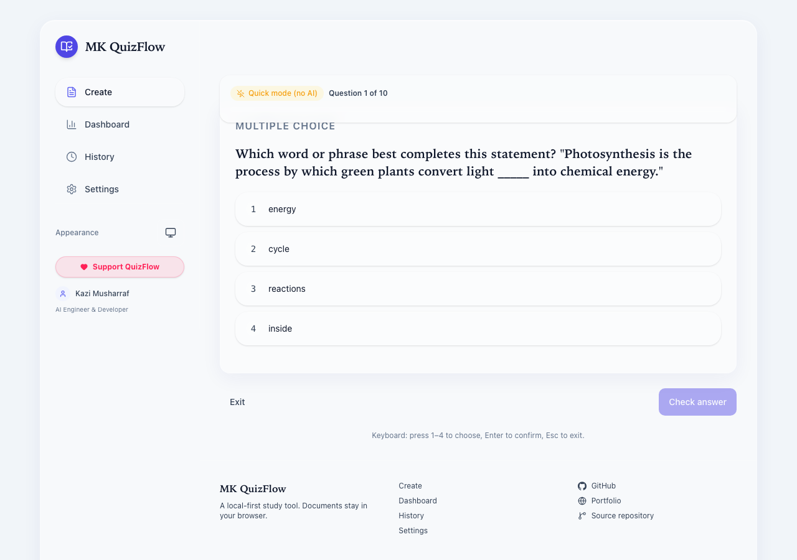

# MK QuizFlow

Turn PDFs and pasted notes into quizzes and flashcards, right in your browser. The deterministic **Quick mode** works with zero AI keys; an optional AI layer adds higher-quality generation. Documents never leave your device unless you explicitly use AI mode.

- **Live:** https://quizflow.mkazi.live
- **Source:** https://github.com/mk-knight23/35-tool-pdf-to-quiz
- **License:** MIT



## What it does

Paste text or upload a text-based PDF, pick how many questions you want and which types, and QuizFlow builds a quiz you can play, score, and export — or a flashcard deck you can review with spaced repetition. Everything works offline in Quick mode. AI mode is optional and clearly labelled.

## Features

- **Two sources:** paste text/markdown, or upload a PDF (drag-and-drop, ≤ 20 MB, in-browser extraction with `pdfjs-dist`, page-range selection, honest error on scanned/image-only PDFs).
- **Quick mode (no AI):** deterministic sentence + keyword heuristics generate MCQ, true/false, short-answer, and fill-in-the-blank questions. Identical input always yields identical output. Clearly badged; never presented as AI output.
- **AI mode (optional):** `POST /api/ai/*` via the Vercel AI Gateway — quiz/flashcard/summary/explain/weak-topic/regenerate. Uses the deployment's shared allowance first, with BYOK fallback. Falls back to an honest "AI unavailable" state, never fake output.
- **Quiz player:** MCQ / TF / short / fill, optional timed mode, per-question feedback, review errors, **retake incorrect only**, full keyboard support (1–4 select, Enter confirm/next, Esc exit).
- **Question editor:** edit text/options/answer/explanation, reorder (buttons + keyboard), delete, duplicate detection, and true regenerate (per-question and whole-quiz, with a confirm dialog before discarding edits).
- **Flashcards:** flip UI (motion-safe crossfade), spaced self-grading (Again/Hard/Good/Easy) driving a local SM-2-style review queue with honest due counts.
- **Export:** JSON (versioned, re-importable), CSV, Markdown, and printable HTML (browser print-to-PDF). Exports carry the Quick-mode label when applicable.
- **Dashboard & history:** real local stats only (quizzes created, questions answered, accuracy, time studied) with honest empty states before first use.
- **Privacy-first:** all user data lives in IndexedDB; documents are never stored server-side.

## Tech stack

Next.js (App Router, TypeScript strict) · Tailwind CSS v4 · lucide-react · Zod · IndexedDB via `idb` · Vercel AI SDK (gateway model strings) · Vitest + Testing-library · Playwright · pnpm.

## Getting started

```bash
pnpm install
pnpm dev            # http://localhost:3000
```

This repo uses **port 3101** for its production smoke run:

```bash
pnpm build
pnpm exec next start --port 3101
```

## Environment variables

All are optional — the app runs fully in Quick mode with none set. See `.env.example` for the annotated list.

| Variable | Purpose | Default |
| --- | --- | --- |
| `NEXT_PUBLIC_SITE_URL` | Canonical/OG base URL | `https://quizflow.mkazi.live` |
| `AI_GATEWAY_API_KEY` | Server AI Gateway credential (or Vercel OIDC on deploy) | unset → AI disabled, Quick mode only |
| `AI_MODEL` | Fast-tier gateway model string | `anthropic/claude-haiku-4.5` |
| `AI_MODEL_QUALITY` | Quality-tier gateway model string | `anthropic/claude-sonnet-4-5` |
| `NEXT_PUBLIC_GTM_ID` | GTM container (analytics) | unset → analytics fully disabled |
| `NEXT_PUBLIC_ADSENSE_ENABLED` | Enable reserved ad slots | `false` |

## Architecture

- `src/app` — App Router pages and the `POST /api/ai/[capability]` route.
- `src/components` — UI (layout, tool, player, flashcards, analytics).
- `src/lib` — pure logic: `generator`, `text`, `scoring`, `dedupe`, `srs`, `stats`, `share`, `export`, `storage`, and `ai/*` (catalog, capabilities, quota, rate-limit, models, client).

See [ARCHITECTURE.md](ARCHITECTURE.md), [AI_ARCHITECTURE.md](AI_ARCHITECTURE.md), and [DATABASE.md](DATABASE.md).

## Testing

```bash
pnpm typecheck        # tsc --noEmit
pnpm lint             # eslint src
pnpm test             # vitest run
pnpm test:coverage    # vitest run --coverage
pnpm build            # next build
pnpm exec playwright test   # smoke suite on port 3101
```

Latest local run: **206 unit tests passing** across 21 files (86.85% statement / 94.94% function coverage on `src/lib`), **5 Playwright smoke tests passing** (desktop + mobile + keyboard). Full command output is in [TEST_REPORT.md](TEST_REPORT.md).

## Deployment

Target is Vercel (deployment and DNS orchestrated separately). See [DEPLOYMENT.md](DEPLOYMENT.md). CI runs typecheck, lint, unit tests + coverage, build, gitleaks, a non-blocking dependency audit, and the Playwright smoke — see `.github/workflows/ci.yml`.

## Privacy & security

Documents are processed in your browser; with AI mode, text is streamed to the route and discarded (never stored server-side). Analytics are consent-gated and default off. BYOK keys stay in the browser tab only. See [PRIVACY.md](PRIVACY.md) and [SECURITY.md](SECURITY.md).

## Roadmap

- Optional OCR path for scanned PDFs (currently a stated non-goal).
- More export targets (Anki, LMS-friendly formats).
- Richer weak-topic analytics from local history.

## Author

**Kazi Musharraf** — AI Engineer · Full-Stack Developer · Open-Source Builder
GitHub: https://github.com/mk-knight23 · Portfolio: https://www.mkazi.live

Built and maintained by Kazi Musharraf. Open source for everyone.

## License

[MIT](LICENSE) © 2026 Kazi Musharraf.
