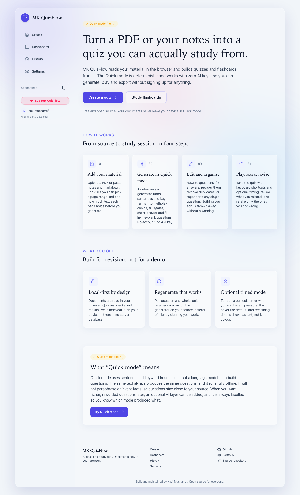

# MK QuizFlow

Turn PDFs, notes and pasted text into quizzes, flashcards and practice tests — right in your browser.

[](LICENSE)
[](https://nextjs.org)
[](https://www.typescriptlang.org)

## Live

- Production: **https://quizflow.mkazi.live** _(custom domain — DNS pending; see the launch guide below)_
- Current deploy: **https://mk-quizflow.vercel.app**

## What it does

Turn PDFs, notes and pasted text into quizzes, flashcards, practice tests and study material. Paste your material or upload a text-based PDF, choose how many questions you want and which types, and QuizFlow builds a quiz you can play, score and export — or a flashcard deck you can review with spaced repetition.

It works offline in **Quick mode** with no AI key needed. Nothing about your document leaves your device in Quick mode. An optional AI layer is available for higher-quality generation, and it is always clearly labelled.

## Features

- **Two ways in.** Paste text or markdown, or upload a PDF (drag-and-drop, up to 20 MB). PDF text is extracted in the browser with `pdfjs-dist`, with page-range selection and per-page character counts so empty or scanned pages are obvious. Scanned/image-only PDFs get an honest "no extractable text" message — there is no OCR yet.
- **Quick mode (no AI, deterministic).** Sentence and keyword heuristics build multiple-choice, true/false, short-answer and fill-in-the-blank questions. The same input always produces the same output. It is badged as Quick mode everywhere and is never dressed up as AI output.
- **Optional AI mode.** `POST /api/ai/*` routes through the Vercel AI Gateway for quiz, flashcard, summary, explanation, weak-topic and regenerate capabilities. It uses the deployment's shared daily allowance first, with a bring-your-own-key fallback. When no credentials are available it degrades to an honest "AI unavailable" state — never fake questions.
- **Quiz player.** MCQ, true/false, short-answer and fill-blank; optional timed mode; per-question feedback; review your mistakes; **retake incorrect only**; full keyboard support (1–4 to select, Enter to confirm/advance, Esc to exit).
- **Question editor.** Edit text, options, the correct answer and explanations; reorder with buttons or the keyboard; delete; duplicate detection; and real regeneration per-question or for the whole quiz, with a confirm step before discarding edits.
- **Flashcards.** A flip UI with a motion-safe crossfade fallback and self-grading (Again / Hard / Good / Easy) that drives a local SM-2-style review queue with honest due counts.
- **Export.** JSON (versioned and re-importable), CSV, Markdown, and printable HTML for browser print-to-PDF. Exports carry the Quick-mode label when it applies.
- **Dashboard and history.** Real local stats only — quizzes created, questions answered, accuracy, time studied — with honest empty states before your first quiz. History is searchable and entries reopen in the player or editor.
- **Local-first by default.** All of your data lives in IndexedDB on your device. There is no account and no server database.

## Screenshots

| Home | Quiz player |
| --- | --- |
|  |  |

## Tech stack

- **Next.js** (App Router) with **TypeScript** in strict mode.
- **Tailwind CSS v4** for styling, with CSS-variable design tokens.
- **IndexedDB** (via the `idb` package) for local-first persistence.
- **Vercel AI Gateway** (through the Vercel AI SDK) for the optional AI layer, using gateway model strings so a model swap is a one-line env change.
- Supporting libraries: `pdfjs-dist` (in-browser PDF extraction), `zod` (input validation), `lucide-react` (icons), `clsx` + `tailwind-merge` (class handling).
- Tooling: Vitest for unit tests, Playwright for the end-to-end smoke, pnpm as the package manager.

**No database, no accounts, no signup.** The app is fully usable with zero configuration.

## Project structure

Tests live next to the code they cover as `*.test.ts` files; only the source modules are listed below.

```
src/
├── app/                         # Next.js App Router — pages, routes and metadata
│   ├── layout.tsx               # Root layout: metadata, theme, consent and analytics wiring
│   ├── page.tsx                 # Landing page
│   ├── globals.css              # Tailwind v4 theme + design tokens
│   ├── loading.tsx              # Global loading UI
│   ├── error.tsx                # Root error boundary
│   ├── not-found.tsx            # Custom 404 page
│   ├── robots.ts                # robots.txt generator
│   ├── sitemap.ts               # XML sitemap generator
│   ├── opengraph-image.tsx      # Open Graph social card (rendered with next/og)
│   ├── twitter-image.tsx        # Twitter/X social card
│   ├── api/ai/[capability]/route.ts  # Serverless AI endpoint: rate-limit → quota → gateway
│   ├── tool/                    # Main quiz workspace (upload → configure → generate → play)
│   ├── flashcards/              # Flashcard deck player
│   ├── dashboard/               # Local stats dashboard
│   ├── history/                 # Past quizzes, decks and results
│   ├── settings/                # Data export/import, consent, BYOK key, ad flag
│   ├── docs/                    # In-app documentation page
│   ├── guides/                  # Guide index + guides/[slug] article pages
│   ├── use-cases/               # Use-case index + use-cases/[slug] pages
│   ├── faq/                     # FAQ (FAQPage structured data)
│   ├── changelog/               # Changelog page
│   ├── about/                   # About the product
│   ├── creator/                 # Creator profile (Person structured data)
│   ├── open-source/             # Open-source page
│   ├── privacy/                 # Privacy policy
│   ├── terms/                   # Terms of use
│   ├── cookies/                 # Cookie policy + consent controls
│   └── contact/                 # Contact page
│
├── components/                  # UI components
│   ├── layout/                  # Header, footer, theme toggle + no-flash theme script,
│   │                            #   consent banner, and analytics loaders (GTM/GA, Vercel)
│   ├── tool/                    # SourceInput (paste/PDF + page range), GenerateConfig,
│   │                            #   QuestionEditor, ExportMenu, and the reserved AdUnit slot
│   ├── player/                  # QuizPlayer (MCQ/TF/short/fill) and QuizResults
│   ├── flashcards/              # FlashcardPlayer (flip + self-grading)
│   ├── analytics/               # TrackOnMount helper
│   └── ui/                      # Design-system primitives: Button, Badge, ConfirmDialog,
│                                #   EmptyState, ProgressRing, icons
│
└── lib/                         # Pure logic, framework-free where possible
    ├── types.ts                 # Shared domain types
    ├── generator.ts             # Deterministic Quick-mode question generator
    ├── text.ts                  # Sentence/keyword text heuristics
    ├── pdf.ts                   # In-browser PDF text extraction (pdfjs-dist)
    ├── scoring.ts               # Quiz scoring
    ├── dedupe.ts                # Duplicate-question detection
    ├── srs.ts                   # SM-2-style spaced-repetition scheduler
    ├── stats.ts                 # Derived dashboard stats from local history
    ├── storage.ts               # IndexedDB persistence behind one interface (idb)
    ├── prefs.ts                 # Small localStorage preferences
    ├── share.ts                 # Share-by-URL encode/decode (zod-validated)
    ├── export.ts                # JSON / CSV / Markdown / printable-HTML exporters
    ├── id.ts                    # crypto.randomUUID id generation (with fallback)
    ├── cn.ts                    # className merge (clsx + tailwind-merge)
    ├── analytics.ts             # Typed track() with the consent gate
    ├── audio.ts                 # Web Audio click sounds
    ├── tips.ts                  # Rotating study tips
    ├── site.ts                  # Site + creator constants
    ├── guides.ts                # Guides content data
    ├── use-cases.ts             # Use-cases content data
    ├── og-image.tsx             # Shared OG image renderer
    └── ai/                      # AI layer: catalog, capabilities, models (env defaults),
                                 #   quota (daily), rate-limit (per-IP), errors, request, client
```

## Getting started

Prerequisites: **Node 20+** (Next.js 16 needs Node 20.9+) and **pnpm**.

```bash
pnpm i          # install dependencies
pnpm dev        # start the dev server at http://localhost:3000
pnpm build      # production build
pnpm test       # run the unit tests (Vitest)
```

Other useful scripts: `pnpm lint`, `pnpm typecheck`, `pnpm test:coverage`, and `pnpm e2e` (Playwright smoke).

## Environment variables

Every variable is **optional**. The app builds and the deterministic Quick mode works with **none of them set** — when AI credentials are missing, AI mode shows a graceful "AI unavailable" fallback and everything else keeps working. Copy `.env.example` to `.env.local` to set any of them.

| Variable | Purpose | Required? |
| --- | --- | --- |
| `AI_GATEWAY_API_KEY` | Server Vercel AI Gateway key (`vck_…`) for AI mode. On Vercel, OIDC can supply this automatically. | No — unset means Quick mode only |
| `VERCEL_OIDC_TOKEN` | Ambient AI Gateway credential injected by `vercel dev` and by Vercel at deploy time. | No — managed by Vercel, do not set by hand |
| `AI_MODEL` | Fast-tier gateway model string. | No — defaults to `anthropic/claude-haiku-4.5` |
| `AI_MODEL_QUALITY` | Quality-tier gateway model string. | No — defaults to `anthropic/claude-sonnet-4-5` |
| `NEXT_PUBLIC_SITE_URL` | Canonical/OG base URL for SEO and the sitemap. | No — defaults to `https://quizflow.mkazi.live` |
| `NEXT_PUBLIC_GTM_ID` | Google Tag Manager container id. | No — unset disables analytics entirely |
| `NEXT_PUBLIC_GA_ID` | Google Analytics id. | No — unset disables analytics entirely |
| `NEXT_PUBLIC_ADSENSE_ENABLED` | Master switch for reserved ad slots. | No — defaults to `false` (no ad scripts load) |
| `NEXT_PUBLIC_ADSENSE_CLIENT_ID` | AdSense publisher id, only used when ads are enabled. | No |
| `NEXT_PUBLIC_SPONSOR_URL` | Optional sponsor/"buy me a coffee" link shown in the fallback ad slot. | No |

## Privacy

QuizFlow is local-first. Your material is processed in your browser, and your quizzes, decks, results and settings live in IndexedDB on your device.

- **In Quick mode, nothing leaves the browser.** PDF text is extracted and questions are generated entirely on your device.
- **In AI mode, text is streamed to the serverless route and discarded** — it is never written to logs or disk, and documents are never stored server-side.
- **Analytics are off by default** and only ever run in production after you consent. They record counts, durations and feature names — never document text, quiz content, file names, or keys.
- **Bring-your-own-key stays in the browser tab** (session memory only), is sent per request as a header, and is never logged or persisted.

See [docs/PRIVACY.md](docs/PRIVACY.md) and [docs/SECURITY.md](docs/SECURITY.md) for the full guarantees and threat model.

## Documentation

Deeper reference docs live in [`docs/`](docs/):

- [ARCHITECTURE.md](docs/ARCHITECTURE.md) — system architecture and data flow.
- [AI_ARCHITECTURE.md](docs/AI_ARCHITECTURE.md) — AI routing, quotas, rate limits and BYOK.
- [DATABASE.md](docs/DATABASE.md) — why there is no server database (local-first rationale).
- [DEPLOYMENT.md](docs/DEPLOYMENT.md) — build pipeline and hosting notes.
- [PRIVACY.md](docs/PRIVACY.md) — privacy guarantees.
- [SECURITY.md](docs/SECURITY.md) — threat model and responsible disclosure.
- [PRODUCT_SPEC.md](docs/PRODUCT_SPEC.md) — product spec and acceptance criteria.
- [DESIGN_SYSTEM.md](docs/DESIGN_SYSTEM.md) — the visual design system.
- [ANALYTICS_PLAN.md](docs/ANALYTICS_PLAN.md), [SEO_PLAN.md](docs/SEO_PLAN.md), [MONETIZATION_PLAN.md](docs/MONETIZATION_PLAN.md) — supporting plans.
- [AUDIT.md](docs/AUDIT.md) — the pre-rebuild audit that shaped v2.
- [TEST_REPORT.md](docs/TEST_REPORT.md) — real test and coverage output.

## Deployment & launch guide

### Why Vercel

Vercel is the recommended host and the path this project uses:

- It is the native platform for Next.js App Router — no adapters or custom build config.
- The free (Hobby) tier is enough to run this app.
- The optional AI mode uses serverless functions, which Vercel runs out of the box, and it can supply AI Gateway credentials through OIDC with no key to manage.
- Every branch and pull request gets a preview deployment automatically.

### Deploy it

1. **Fork or clone** this repository to your own GitHub account.
2. **Import the repo into Vercel** (New Project → import from GitHub). Vercel detects Next.js and uses `pnpm` automatically.
3. **Set environment variables** if you want AI mode or analytics — see the table above. You can skip this entirely; the app deploys and works in Quick mode with nothing set.
4. **Deploy.** Vercel builds and gives you a `*.vercel.app` URL (this project's is `mk-quizflow.vercel.app`).

### Custom domain (`quizflow.mkazi.live`)

1. In the Vercel project, open **Settings → Domains** and add `quizflow.mkazi.live`.
2. At the DNS provider (Cloudflare, which manages `mkazi.live`), add the record Vercel asks for:

   ```
   A   quizflow.mkazi.live   76.76.21.21
   ```

   If you use Cloudflare's proxy, set this record to **DNS only** (grey cloud) so Vercel can validate it.
3. **SSL issues automatically** once the DNS record resolves — no manual certificate step.

### Future standalone domain (`mkquizflow.com`)

If QuizFlow graduates to its own domain (candidate: `mkquizflow.com`):

1. Buy the domain and add it in **Settings → Domains** as the new primary, pointing its apex `A` record to `76.76.21.21` (and a `CNAME` for `www` to `cname.vercel-dns.com`).
2. Keep `quizflow.mkazi.live` attached and set it to **redirect** to the new primary domain in Vercel's domain settings, so old links keep working.

## Roadmap

- Wire the production AI Gateway key so shared-allowance AI mode is live on the deployment.
- Add an optional OCR path for scanned/image-only PDFs (currently a stated non-goal).
- Expand export targets (Anki and LMS-friendly formats).
- Write more study guides and richer weak-topic analytics from local history.

## About the creator

**Kazi Musharraf** — AI Engineer · Full-Stack Developer · Open-Source Builder.

- GitHub: https://github.com/mk-knight23
- Portfolio: https://www.mkazi.live

## License

[MIT](LICENSE) © 2026 Kazi Musharraf.

---

Built and maintained by Kazi Musharraf. Open source for everyone.
